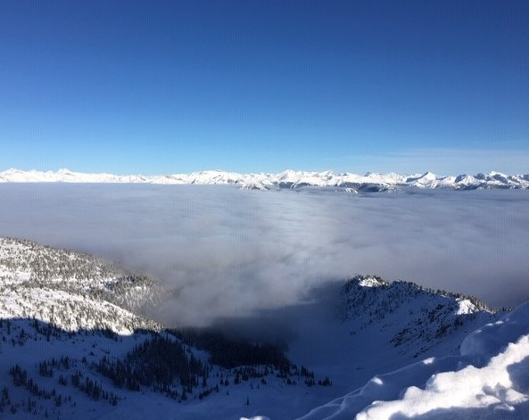

I'm a PhD candidate in mathematics under the supervision of [Bob Haslhofer](https://www.math.toronto.edu/roberth/) and [Catherine Sulem](https://www.math.toronto.edu/sulem/) at the University of Toronto. My hobbies include searching for untracked powder and big mountain lines in Western Canada.

Contact Information
======
  - email: christopherpa _dot_ kennedy _at_ mail _dot_ utoronto _dot_ ca
  - address: HU1016, 215 Huron Street, Toronto, ON, M5S 1A2

