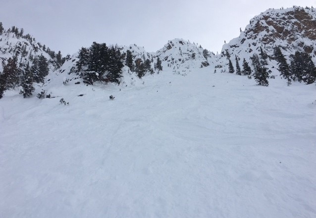

Research Interests
======

My field of research focuses on the analysis of partial differential equations and their applications to geometric analysis and hydrodynamics.

  - partial differential equations
  - water waves
  - applied mathematics
  - geometric analysis

Articles and Preprints
======
  - C. Kennedy, _A Bochner Formula on Path Space for the Ricci Flow_ (2022), Calc. Var. PDE **62** 2023, (no. 83). \[[journal](https://doi.org/10.1007/s00526-022-02420-3) \| [pdf](/assets/1909.04193.pdf) \| [arxiv](https://arxiv.org/abs/1909.04193)\]
  - A. Kairzhan, C. Kennedy and C. Sulem, _Interaction of Internal and Surface Waves in Deep Water_, in preparation.

Lecture Notes
======
  - Solutions to Stochastic Differential Equations, _Oksendal_ \[[pdf](/assets/Solutions_to_Oksendal.pdf)]

