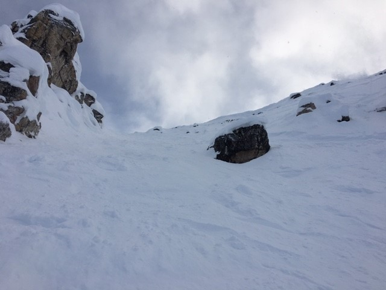

I have taught lower-year courses in calculus (differential, integral and multivariate), real analysis and linear algebra as well as higher-level courses in partial differential equations and stochastic processes.

Queen's
======

<ul style='width: 115%;'>
  <li> MTHE 224 Applied Math for Civil Engineers (Fall 2024) </li>
  <li> APSC 174 Introduction To Linear Algebra (Winter 2024) </li>
  <li> MATH 121 Differential and Integral Calculus (Fall 2023) </li>
</ul>

U of T
======

<ul style='width: 115%;'>
  <li> APM346 Partial Differential Equations (Winter 2022) </li>
  <li> MAT235 Calculus II (Summer 2020, 2021) [<a href="https://mymedia.library.utoronto.ca/play/0e62e29654335560a755ad46df70ead4/">Lecture 23]</a> | <a href="/assets/235-A4.pdf">Assignment 4</a>] </li>
  <li> STAC63 Probability Models (Winter 2021) [<a href="https://mymedia.library.utoronto.ca/play/b3a9414b831b34b3c0fdeff44c791fb9">Lecture 11</a> | <a href="/assets/C63-final.pdf">final</a>] </li>
  <li> MATA31 Calculus for Mathematical Sciences I (Winter 2020) </li>
  <li> MATB24 Linear Algebra II (Fall 2019) </li>
  <li> MATA33 Calculus for Management II (Winter/Summer 2019) </li>
</ul>
  

